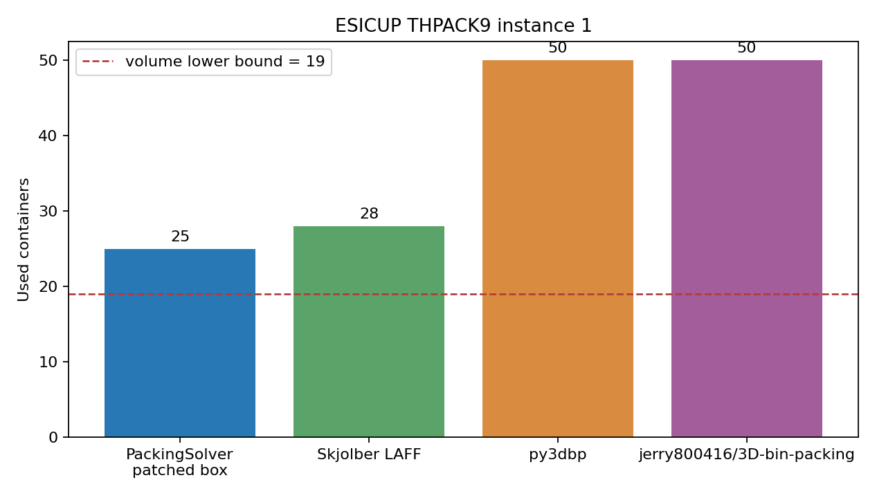

# 三维装箱求解器、约束模型与可视化技术选型

> 基准日 **2026-08-31** ｜ 能力矩阵 **14 行算法/库** ｜ THPACK **759 个合法源** ｜ THPACK9 **44 个跨实现实例** ｜ 上游缺陷与 fork 修复分别验证

三维装箱软件面对的不是一个 `pack()` 函数，而是一组不同的优化问题：固定容器的 3D knapsack、同型容器的 3D bin packing、多箱型有成本与库存限制的 variable-sized BPP、带堆叠/承压/轴荷/多站卸货的运输装载，以及连续姿态的非正交装箱。本仓库把这些问题形式化，核对论文和官方文档，审计开源实现，接入 ESICUP 公共 benchmark，并用独立 validator 检查布局、数量、重量和证书。

**完整报告：[`report.md`](report.md)**



---

## 主要结论

| # | 结论 | 证据 |
|---|---|---|
| 1 | **推荐分层架构：CP-SAT/SCIP 负责成本与 exact-small，PackingSolver 负责正交布局，所有结果经过独立 validator。** | [`report.md`](report.md)、[`research/decision-matrices.md`](research/decision-matrices.md) |
| 2 | **PackingSolver 原版异构成本路径是上游缺陷，不是调用错误。** `box` 与 `boxstacks` 漏掉 `VariableSizedBinPacking` 的方案比较分支；本地最小 patch 两条路径均通过；issue [#536](https://github.com/fontanf/packingsolver/issues/536) 与 PR [#540](https://github.com/fontanf/packingsolver/pull/540) 仍在 open。 | [`research/packingsolver-upstream.md`](research/packingsolver-upstream.md) |
| 3 | **THPACK9 44 个合法实例：PackingSolver mean 15.48 箱、Skjolber Plain 17.80、Rust ExtremePoint adapter 18.41、py3dbp 降序 18.43、Go bp3d 19.93、Skjolber LAFF 20.84，以上均为 44/44 有效 certificate。** 数据没有 published optimum，只能报告 incumbent。 | [`results/campaign/README.md`](results/campaign/README.md)、[`research/benchmarks.md`](research/benchmarks.md) |
| 4 | **py3dbp、Jerry 和 Go bp3d 不能承担业务真值。** py3dbp 顺序敏感，Jerry 的 `loadbear` 只是排序，Go bp3d 的 `MaxWeight` 没进入放置检查。 | [`research/algorithms.md`](research/algorithms.md)、代码审计和反例 |
| 5 | **桌面首选 Tauri 2 + React/TypeScript + Three.js + Python worker。** 大 placement 数据写入 job bundle，进度走版本化事件，3D 场景与表格按稳定 ID 联动。 | [`research/frontend.md`](research/frontend.md)、[`research/decision-matrices.md`](research/decision-matrices.md) |
| 6 | **PackingSolver 的额外预算主要改善 knapsack，不改善本轮 THPACK9 箱数。** BR mean utilization 从 0.7216 升到 0.9624，LN 从 0.5072 升到 0.7115；THPACK9 44 对箱数全部相同。 | [`results/campaign/aggregate.json`](results/campaign/aggregate.json) |
| 7 | **CP-SAT、SCIP、Gurobi、CPLEX 的 strengthened exact-small 均为 7/7。** legacy/reduced 的失败说明 formulation 和许可证规模会改变结果，不能当通用速度榜。 | [`results/campaign/README.md`](results/campaign/README.md) |

## 已知限制与修正

本轮将四个可复现的 PackingSolver 问题提交为 [#536](https://github.com/fontanf/packingsolver/issues/536)、[#537](https://github.com/fontanf/packingsolver/issues/537)、[#538](https://github.com/fontanf/packingsolver/issues/538)、[#539](https://github.com/fontanf/packingsolver/issues/539)，对应修复 PR 为 [#540](https://github.com/fontanf/packingsolver/pull/540)、[#541](https://github.com/fontanf/packingsolver/pull/541)、[#542](https://github.com/fontanf/packingsolver/pull/542)、[#543](https://github.com/fontanf/packingsolver/pull/543)。截至 2026-08-31 均未合并，patch 二进制不能当作官方 release。用户维护的公开 fork [`HansBug/packingsolver@d953148b`](https://github.com/HansBug/packingsolver/tree/d953148b8f710c06fa6c410949b7272f9e36327b) 已整合四个修复及追加的 data-driven 回归测试；完整 campaign 固定到这个提交。学术 DOI、THPACK 语义、LAFF 性能措辞、CPLEX 接口归属和来源 commit 的修正记录在 [`audit/academic_audit.md`](audit/academic_audit.md)，实验范围和状态见 [`results/campaign/`](results/campaign/) 与 [`results/test-summary.md`](results/test-summary.md)。

## 目录

```text
report.md                         总报告：问题、模型、算法、benchmark、前端与路线
research/test-protocol.md         B01-B32 全库综合 benchmark、状态、排行与发布协议
research/                         学术综述、能力矩阵、公共数据集、上游审计
benchmarks/                       受控脚本、统一数据转换器、独立 validator
results/                          机器可读结果与测试摘要
raw/                              原始结果快照（由 scripts/collect_raw.py 生成）
derived/                          统计表和 manifest 派生文件
figures/                          由 scripts/plot.py 生成的图
sources/                          URL、DOI、官方文档和关键逐字引文登记
audit/                            复现审计、学术审计、自审迭代日志
scripts/                          分析、绘图、manifest、verify、Markdown 门禁和全量复现入口
LICENSE / DATA-LICENSE.md         代码许可和外部数据许可边界
CITATION.cff                      GitHub “Cite this repository” 信息
references.bib                    主要论文与数据集的 BibTeX 条目
REVIEW.md / CLAUDE.md              发布门禁和写作/实验工作约定
```

审计入口：[`sources/manifest.csv`](sources/manifest.csv)（来源、版本、快照哈希）、[`sources/quotes.md`](sources/quotes.md)（关键逐字引文）、[`audit/claims.csv`](audit/claims.csv)（断言证据映射）、[`audit/reproducibility_audit.md`](audit/reproducibility_audit.md) 和 [`audit/academic_audit.md`](audit/academic_audit.md)。

## 复现

项目要求 Python 3.12。干净环境可按下面的步骤建立虚拟环境并安装测试依赖；仓库自带的 `raw/`、`derived/` 和 `figures/` 已足够执行离线校验，不需要下载求解器。

```bash
python3.12 -m venv .venv
.venv/bin/python -m pip install --upgrade pip
.venv/bin/python -m pip install -e '.[test]'
```

离线重算和机器检查：

```bash
.venv/bin/python scripts/analyze.py
.venv/bin/python scripts/plot.py
.venv/bin/python benchmarks/comprehensive/build_plan.py --check
.venv/bin/python scripts/verify.py
.venv/bin/python -m pytest -q
```

需要运行 Python/Jerry/公共数据转换时，先执行 `bash scripts/fetch_dependencies.sh` 固定外部 source checkout，再运行下方命令。PackingSolver 的预编译二进制和 Skjolber 的 Maven/JDK 环境不随脚本下载，需按 [`research/test-protocol.md`](research/test-protocol.md) 的版本、运行矩阵与 SHA-256 要求自行准备；无网络或缺少 native/JVM 工具链时，仍可只做上述离线校验。

候选库受控 smoke test：

```bash
bash benchmarks/run_controlled.sh
bash benchmarks/run_java_controlled.sh
.venv/bin/python benchmarks/convert_thpack9.py
.venv/bin/python benchmarks/benchmark_public_thpack9.py
```

既有 campaign 的脚本、每类 benchmark 的用途和逐库运行状态见 [`results/campaign/README.md`](results/campaign/README.md)；下一轮“全部问题族 × 全部候选库”的 B01-B32 范围、状态词、排行与验收门以 [`research/test-protocol.md`](research/test-protocol.md) 为准。已有结果的统一重算命令为：

```bash
.venv/bin/python benchmarks/campaign/analyze_campaign.py
.venv/bin/python scripts/verify.py
```

公共数据转换依赖 `.cache/esicup-datasets` 的 shallow checkout；没有该目录时脚本会明确报出缺少来源，不会静默生成替代实例。PackingSolver 的原始滚动二进制、修复版源码副本和 SHA-256 只作为审计实验输入，不伪装成官方 release。

## 可审计性

正式实验协议要求每个新结果记录输入实例、库版本/提交、参数、seed、时间/内存/线程限制、stdout/stderr、退出码、证书路径和 validator 结果；本轮公共 THPACK9 JSON 已记录版本/commit、参数、来源 hash 和 validator，其他 smoke 结果的原始日志、退出码、资源和输入由 `raw/experiments/` 与 `raw/provenance.json` 绑定，未生成证书的路径明确保留为空。`raw/` 是发布用的 canonical 原始目录，其中 `raw/experiments/` 完整镜像工作目录的原始日志；`derived/` 由脚本重新生成，`sources/manifest.csv` 登记 URL、访问日期、快照路径和哈希，`audit/` 记录被推翻的结论、未测试项和子代理 review。`verify.py` 只证明登记的断言，不替代人工逐条引用审阅。

## 边界

公开几何 benchmark 不能证明材料强度、动态稳定、摩擦、系固、危险品或车辆法规合规；没有真实字段的约束报告为 `NOT_APPLICABLE` 或 `UNKNOWN`。x86-64 实测不能外推到 aarch64、loongarch64 或其他平台。OR-Tools CP-SAT、SCIP、Gurobi 与 CPLEX 已在同一 7 场景 strengthened 模型上运行；它们是建模后端，不是现成 3D packer。Go `bp3d` 与 Rust `u-nesting` 已用固定工具链运行，结果中的失败和 adapter 能力边界不得改写为未测试或原生支持。

## 许可

原创代码和报告按 Apache-2.0 发布。ESICUP 和各第三方库、论文、数据集按其原始许可与引用要求使用，边界见 [`DATA-LICENSE.md`](DATA-LICENSE.md)。
